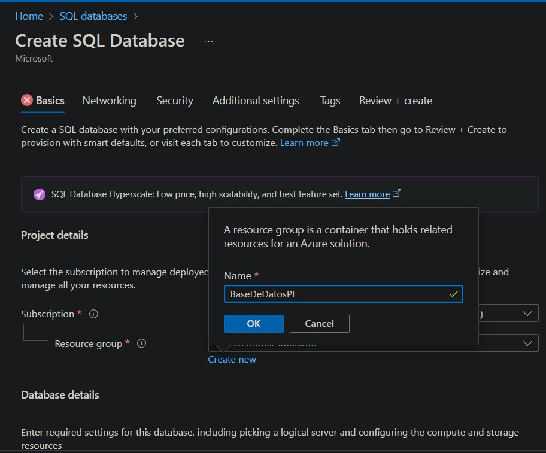
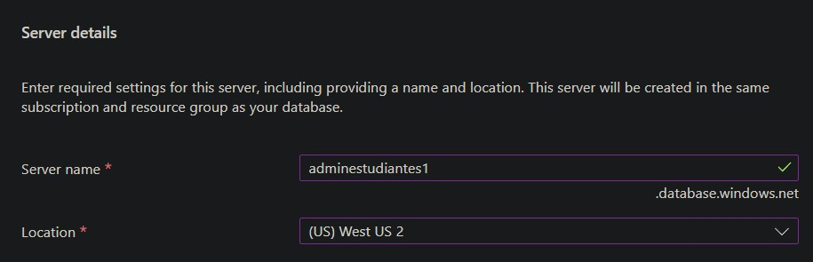
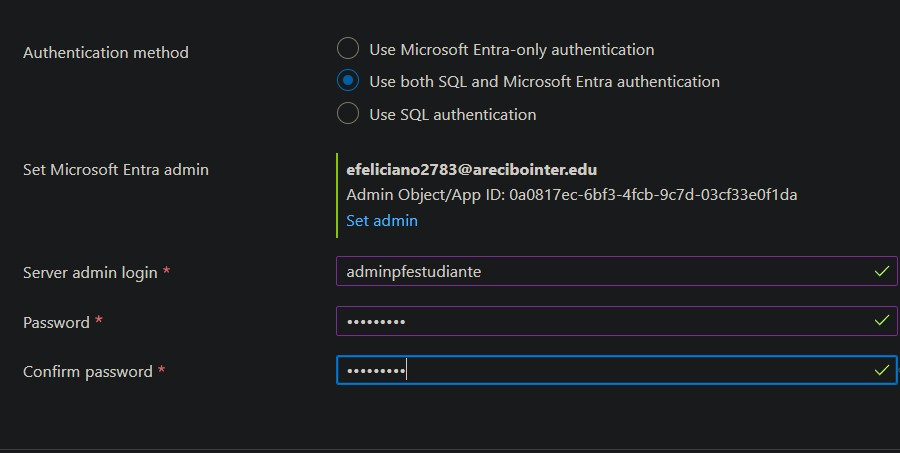
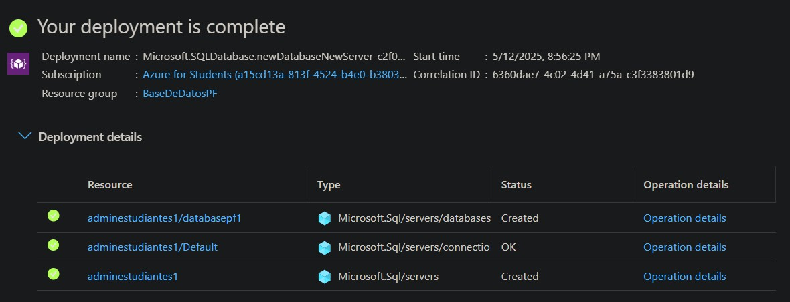
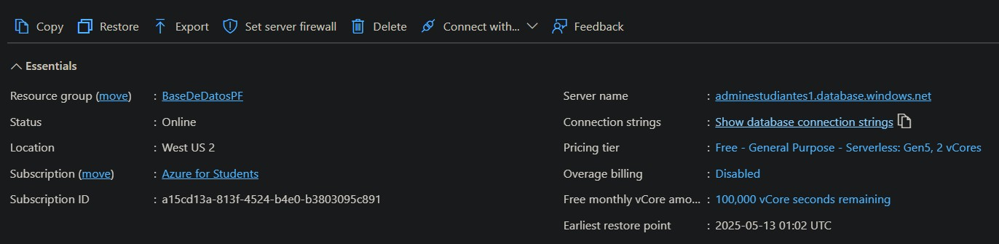

# App Task Go

---

## 🧑‍💻 Integrantes del Equipo
- Génesis Ojeda - R581877 - genesismojeda@gmail.com
- Elier -  - 
- Abimael Santa Cruz - R00627260 - abimael.santa1@gmail.com

---
## 🎯 Descripción General
- ¿Qué hace?
    - Gestiona y maneja diferentes tareas a completar. Donde es el usuario quien define sus tareas,
     establece su estado una vez completadas y le permite eliminarlas.   
- ¿A quién va dirigida?
    - Esta aplicación va dirigida tanto a estudiantes o a cualquier persona que necesite establer
     un listado de deberes o tareas a completar.
- ¿Qué problema resuelve o qué funcionalidad ofrece?
    - Ofrece una solución a la desorganización y manejo de tareas. Mejora la visualización del desgloce 
    de tareas ante una gran carga de deberes a realizar.

---

## ☁️ Servicios de Azure Utilizados
| Servicio              | Propósito dentro del proyecto                    | Gratuito en Azure for Students |
|-----------------------|--------------------------------------------------|--------------------------------|
| Azure App Service     | Alojamiento del FrontEnd y Backend de nuestra App| ✅ Sí                          |
| Azure SQL Database    | Almacena y maneja los datos de las tareas        | ✅ Sí                          |

---

## 🧱 Diagrama de Arquitectura

---

## ⚙️ Despliegue y Configuración

### 1. Preparación Local

1. Clona el repositorio.
2. Crea un entorno virtual (opcional): `python -m venv venv`
3. Actívalo y luego instala dependencias: `pip install -r requirements.txt`
4. Configura tus variables de entorno en tu máquina.
5. Ejecuta: `python app.py`
6. Accede a `http://127.0.0.1:5000`

### 2. Configuración en Azure
- **Configuración del App Service**
    
---

## 💻 Enlace a la Aplicación Desplegada
> [App-tasks-go](https://app-tasks-go-hdbxg4fvarfpgua5.eastus2-01.azurewebsites.net/)

---

## 💸 Estimación del Costo (Azure Pricing Calculator)
Describe el costo estimado mensual de tu arquitectura si se ejecutara sin los beneficios gratuitos.  
Incluye una captura de pantalla o PDF del cálculo.  
> [Azure Pricing Calculator](https://azure.microsoft.com/en-us/pricing/calculator/)

---

## 📁 Capturas del Portal de Azure
Agrega capturas mostrando:
- Los recursos creados (App Service, SQL Database, Storage, etc.)
- Configuraciones clave
- **Configuración del SQL Server**
  
    ### Creación de SQL Database  
    

    ### Detalles del Servidor  
    

    ### Auth/Admin Credentials  
    

    ### DB Deployment  
    

    ### Database & SQL Server INFO  
      
    

---

## 📘 Lecciones Aprendidas
- ¿Qué retos enfrentaron y cómo los resolvieron?
    - El principal reto de este proyecto fue el manejo de la plataforma Azure y su portal en la creación
    de los distintos servicios. Al ser un proyecto Capstone fuimos trabajando estas destrezas a lo largo del 
    curso por lo que cuando realizamos las configuraciones necesarias para dichos servicios ya se habia resolvido gran parte del reto.
- ¿Qué aprendieron sobre trabajar con servicios cloud?
    - Principalmente aprendimos de primera mano la versatilidad de esta herramienta y como cada servicio está relacionado y se conecta
    entre sí, mediante los diferentes protocolos. Tanto en una misma red o desde otras redes externas conformando el ecosistema de la Nube. 
- ¿Qué mejorarían en una próxima versión del proyecto?
    -

---

## 📚 Repositorio del Código
> [App-Task-Go-Repo](https://github.com/DevQueenPR/Proyecto-Final-Cloud)

---

## 📄 Instrucciones para Reproducir el Proyecto
1. Clonar el repositorio.
2. Instalar dependencias: `pip install -r requirements.txt` (si aplica).
3. Crear base de datos (opcional: script SQL incluido).
4. Crear variables de entorno necesarias.
5. Ejecutar la aplicación: `python app.py` o comando correspondiente.
6. Acceder desde `localhost` o mediante el App Service.

---

## ✅ Checklist Final
- [✅] App funcional y desplegada
- [✅] Servicios gratuitos utilizados correctamente
- [✅] Diagrama de arquitectura incluido
- [ ] Documentación clara y completa
- [ ] Costos estimados incluidos
- [✅] Repositorio disponible en GitHub
- [ ] Lecciones aprendidas y reflexión final escritas

---

## 🎓 Créditos
Curso: Cloud Computing  
Profesor: Javier A. Dastas  
Universidad Interamericana de Puerto Rico – Recinto de Arecibo
