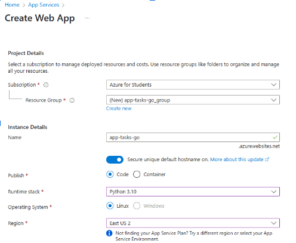
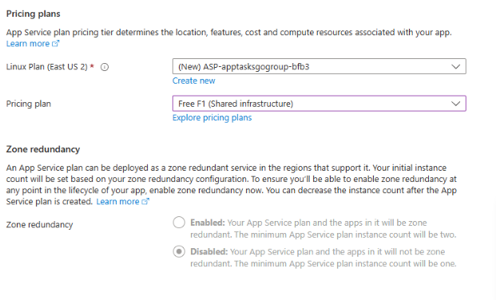
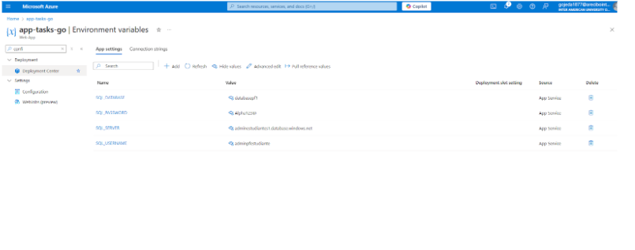
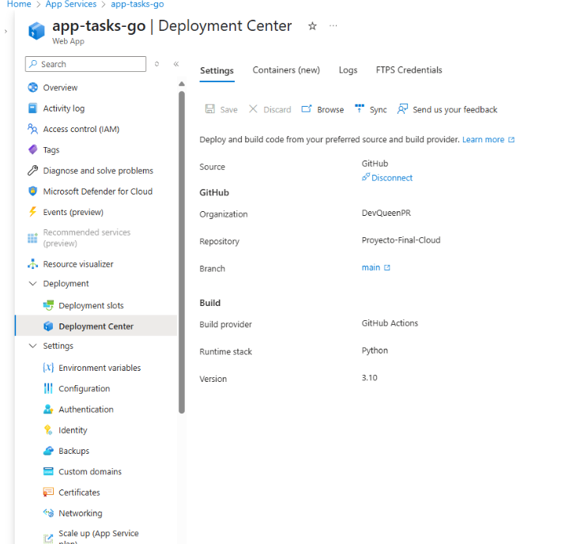
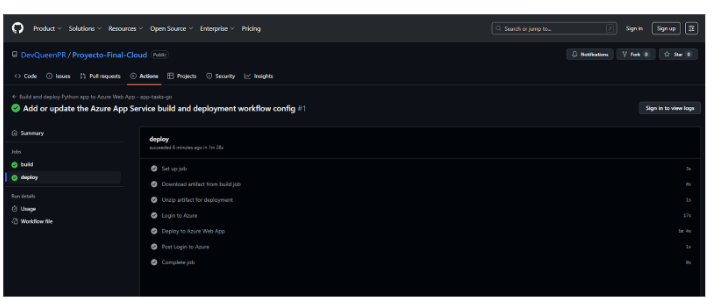
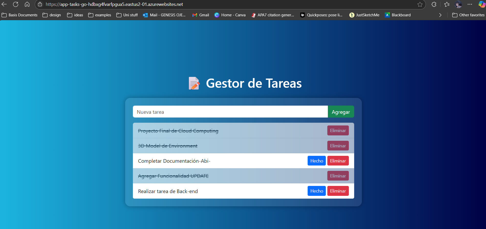
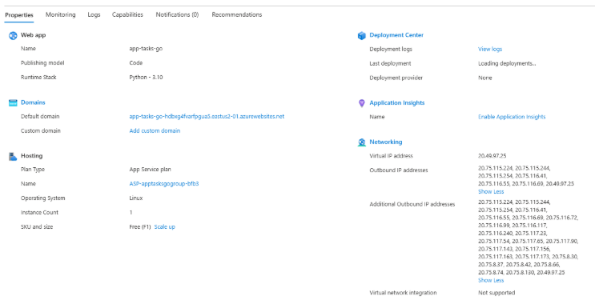

# App Task Go

---

## 🧑‍💻 Integrantes del Equipo
- Génesis Ojeda - R00581877 - genesismojeda@gmail.com
- Eliel Feliciano - R00632783  - efeliciano2783@arecibointer.edu 
- Abimael Santa Cruz - R00627260 - abimael.santa1@gmail.com

---
## 🎯 Descripción General
- ¿Qué hace?
    - Gestiona y maneja diferentes tareas a completar. Donde es el usuario quien define sus tareas,
     establece su estado una vez completadas y le permite eliminarlas.   
- ¿A quién va dirigida?
    - Esta aplicación va dirigida tanto a estudiantes o a cualquier persona que necesite establer
     un listado de deberes o tareas a completar.
- ¿Qué problema resuelve o qué funcionalidad ofrece?
    - Ofrece una solución a la desorganización y manejo de tareas. Mejora la visualización del desgloce 
    de tareas ante una gran carga de deberes a realizar.

---

## ☁️ Servicios de Azure Utilizados
| Servicio              | Propósito dentro del proyecto                    | Gratuito en Azure for Students |
|-----------------------|--------------------------------------------------|--------------------------------|
| Azure App Service     | Alojamiento del FrontEnd y Backend de nuestra App| ✅ Sí                          |
| Azure SQL Database    | Almacena y maneja los datos de las tareas        | ✅ Sí                          |

---

## 🧱 Diagrama de Arquitectura


---

## ⚙️ Despliegue y Configuración

### 1. Preparación Local

1. Clona el repositorio.
2. Crea un entorno virtual (opcional): `python -m venv venv`
3. Actívalo y luego instala dependencias: `pip install -r requirements.txt`
4. Configura tus variables de entorno en tu máquina.
5. Ejecuta: `python app.py`
6. Accede a `http://127.0.0.1:5000`

### 2. Configuración en Azure
 ###     Crear el App Service

1. Accede a **`Home > App Services`** en el portal de Azure.
2. Crea una nueva Web App con los siguientes parámetros:

| Parámetro          | Valor                                |
|--------------------|------------------------------------|
| **Subscription**   | Azure for Students                  |
| **Name**           | `app-tasks-go` (o el que prefieras)|
| **Runtime**        | Python 3.10                        |
| **Operating System**| Linux                             |
| **Region**         | East US 2 (o el más cercano)       |
| **Pricing Plan**   | Free F1 (Shared infrastructure)    |

3. Guardar los cambios.
   
### Configuración de variables de entorno

1. Navega a **`Configuration > Environment Variables`** dentro de tu App Service.
2. Agrega las siguientes variables:

| Variable       | Valor                                      |
|----------------|--------------------------------------------|
| `SQL_SERVER`   | `nombreDeServidor.database.windows.net`    |
| `SQL_DATABASE` | `NombreDeDB`                               |
| `SQL_USERNAME` | `Usuario`                                  |
| `SQL_PASSWORD` | `Password`                                 |

3. Guardar los cambios.
---

### 3. Configuración del despliegue en Azure

1. Accede a **`Home > App Services > app-tasks-go`** en el portal de Azure.

2. Buscar y abrir la opción **`Deployment Center`**.

3. Conectar tu repositorio de GitHub.

4. Seleccionar la rama **`main`** para el despliegue.

5. Luego, accede a la opción **`Configuration`**.

6. En el campo **`Startup Command`**, ingresar el siguiente comando:

    ```bash
    gunicorn --bind 0.0.0.0:8000 app:app
    ```

7. Guardar los cambios y esperar a que el despliegue se complete.

---

## 💻 Enlace a la Aplicación Desplegada
> [App-tasks-go](https://app-tasks-go-hdbxg4fvarfpgua5.eastus2-01.azurewebsites.net/)

---

## 💸 Estimación del Costo (Azure Pricing Calculator)
* Gracias a la **suscripción gratuita** de Azure for Students, los recursos iniciales de este SaaS están siendo costeados. Estos incluyen las instancias de:
    * App Service: F1: Shared Cores, 1 GB RAM, 1 GB Storage
    * Azure Database: General Purpose - Serverless: Gen5, 2 vCores, 100,000 vCore-s

* Teniendo en cuenta que los costos de este software se determinan por la carga de usuarios, es importante considerar los siguientes factores:
    * Un aumento de usuarios activos incrementará el uso de recursos de la base de datos,
    haciendo que esta permanezca activa más tiempo, consumiendo los recursos gratuitos de la
    misma. De igual manera, esto implicaría un tráfico web que podría requerir un cambio de la instancia de App Service de F1 a un *tier* superior como B1 o S1.
    * Para un cálculo de costos más eficiente se deberían utilizar métricas como:
        * La cantidad de usuarios concurrentes por zona horaria
        * La frecuencia de consultas por usuario
        * Promedio de uso diario
        * Tiempo de actividad de la base de datos por mes

* Fórmulas para calcular uso de recursos:
    * App Service: se calcula el % de CPU necesario: usuarios_concurrentes × solicitudes × duración
    * Azure SQL: se calcula el consumo de segundos mensuales: vCore-s = usuarios × consultas × duración × vCores × tiempo

### Caso Hipotético

* Datos:
  * 1,000 usuarios únicos por día
  * Un usuario promedia 5 minutos (300 s)
  * Día en segundos (86,400 s)

* Con esta data, la probabilidad de que un usuario esté utilizando la aplicación en un instante es de 0.00347
    * 300 / 86400 = 0.00347
* El promedio de usuarios recurrentes sería de 4 usuarios:
    * 1,000 × 0.00347 = 3.47

Esta data muestra los usuarios en promedio, por lo que se debería calcular la concurrencia de estos en horas pico. Supongamos que:

* El 80% de los usuarios se conectan entre 2 pm y 6 pm (4 hrs / 14,400 s)
    * Usuarios concurrentes en estas horas pico: 17 usuarios
        * 800 × (300 / 14400) = 16.6 usuarios

* Dadas estas circunstancias, si cada usuario realiza 10 solicitudes por sesión y estas individualmente consumen 0.5 segundos del CPU durante la hora pico, el resultado sería de 1.42 vCores necesarios:
    * Uso de CPU = 17 (usuarios) × 10 (solicitudes) × 0.5 (segundos de CPU) / 60 (1 min)
        * 85 / 60 = 1.42 vCores

* De igual manera, si para el cálculo de Azure SQL cada usuario realiza 10 consultas por sesión, cada una de ellas dura 0.2 segundos, se utiliza 0.25 vCore por consulta, y este usuario se conecta concurrentemente 1 vez al día durante 30 días, el consumo sería:
    * Consumo diario: 17 (usuarios) × 10 (consultas) × 0.2 (segundos × consulta) × 0.25 (uso de vCore) = 8.5 vCore-s por día
    * Consumo mensual: 8.5 × 30 = 255 vCore-s

### Costo

* Para cumplir con las necesidades de este caso, se debería utilizar un App Service como **S2**, el cual contiene 2 vCores para un buen rendimiento en las horas pico sin "cuellos de botella". La base de datos requeriría un consumo promedio de **255 vCore/s** mensualmente, por lo que la opción gratuita cubre esta demanda (cubre 100,000). Sin embargo, si se utilizase la opción de pago premium, el total de la aplicación sería:
    * 1 S2 (2 Core(s), 3.5 GB RAM, 50 GB Storage) × 730 horas = **$138.70**
    * 2 vCore Database(s) × 730 horas, 32 GB Storage = **$372.97**

***Total: $511.67***

---

## 📁 Capturas del Portal de Azure

- **Configuración del SQL Server**
  
    ### Creación de SQL Database  
    

    ### Detalles del Servidor  
    

    ### Credentiales de autenticación y admin
    

    ### Desplego de la base de datos  
    

    ### Información de la base de datos y servidor de SQL    
      
    

- **Configuración del Web App**
  
    ### Creación de Web App  
    
    

    ### Variables de Entorno 
    

    ### Desplego del Web App   
    
    

    ### Desplego exitoso  
    

    ### Web App   
      

    ### Información del Web App   
      

---

## 📘 Lecciones Aprendidas
- ¿Qué retos enfrentaron y cómo los resolvieron?
    - El principal reto de este proyecto fue el manejo de la plataforma Azure y su portal en la creación
    de los distintos servicios. Al ser un proyecto Capstone fuimos trabajando estas destrezas a lo largo del 
    curso por lo que cuando realizamos las configuraciones necesarias para dichos servicios ya se habia resolvido gran parte del reto.
- ¿Qué aprendieron sobre trabajar con servicios cloud?
    - Principalmente aprendimos de primera mano la versatilidad de esta herramienta y como cada servicio está relacionado y se conecta
    entre sí, mediante los diferentes protocolos. Tanto en una misma red o desde otras redes externas conformando el ecosistema de la Nube. 
- ¿Qué mejorarían en una próxima versión del proyecto?
    - Para futuras variaciones a base del proyecto dado, se puede considerar mejorar la experiencia del usuario (UX). Mejorar la interfaz de usuario para expandir su usabilidad y mejorar el rendimiento de la misma debe ser una meta para futuras versiones de este proyecto.

---

## 📚 Repositorio del Código
> [App-Task-Go-Repo](https://github.com/DevQueenPR/Proyecto-Final-Cloud)

---

## 📄 Instrucciones para Reproducir el Proyecto
1. Clonar el repositorio.
2. Instalar dependencias: `pip install -r requirements.txt` (si aplica).
3. Crear base de datos (opcional: script SQL incluido).
4. Crear variables de entorno necesarias.
5. Ejecutar la aplicación: `python app.py` o comando correspondiente.
6. Acceder desde `localhost` o mediante el App Service.

---

## ✅ Checklist Final
- [✅] App funcional y desplegada
- [✅] Servicios gratuitos utilizados correctamente
- [✅] Diagrama de arquitectura incluido
- [ ] Documentación clara y completa
- [ ] Costos estimados incluidos
- [✅] Repositorio disponible en GitHub
- [ ] Lecciones aprendidas y reflexión final escritas


---

## 🎓 Créditos
Curso: Cloud Computing  
Profesor: Javier A. Dastas  
Universidad Interamericana de Puerto Rico – Recinto de Arecibo
